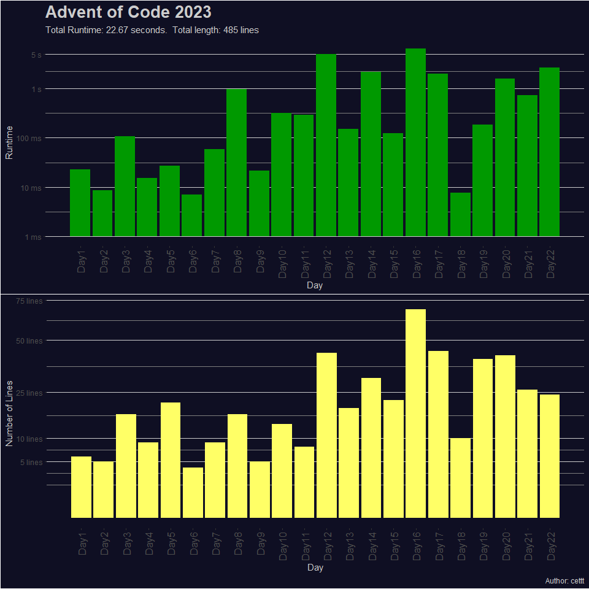

<a href = 'https://adventofcode.com/2023'> Advent of Code 2023 </a>
================

# Summary

Advent of Code is annual event which consists of daily programming
puzzles. The event is hosted by [Eric Wastl](http://was.tl/) and takes
place between December 1st and December 25th.

I solved all puzzles using R (version 4.3.1.) Most of the solutions only
require base packages. For Day 08 I borrowed the function `Lcm` from the
`pracma` package.

I try to go for fast and short solutions which means that the resulting
code is not always as easy to read as it could be.

